# Especificación del Lenguaje XML para Sitios Web Personales (`PersonalSiteML`)

## 1. Introducción y Objetivos

**PersonalSiteML** (`sitio-personal`) es un lenguaje de marcado basado en **XML** diseñado para definir, estructurar y serializar de forma declarativa y completa la información de un sitio web personal profesional.

A partir de un único documento conforme a este estándar, un motor de transformación automatizado (implementado en **TypeScript**, **JavaScript** y asistido por **WebAssembly**) genera la totalidad de los archivos de un sitio web estático moderno:
- **5 páginas HTML5 semánticas y accesibles**:
  1. `index.html` (Página principal / Hero, métricas y tecnologías)
  2. `about.html` (Sobre mí, trayectoria, tabla de datos e intereses)
  3. `projects.html` (Catálogo de proyectos filtrable por categorías)
  4. `cv.html` (Currículum vitae completo: experiencia, formación y competencias)
  5. `contact.html` (Canales de contacto directo, disponibilidad y formulario)
- **Hojas de estilo CSS modulares**:
  - `base.css` (Reset, variables `:root`, tokens tipográficos y espaciado relativo)
  - `layout.css` (Estructura, cabecera accesible, navegación móvil y pie)
  - `index.css`, `about.css`, `projects.css`, `cv.css`, `contact.css` (Estilos específicos de cada vista)
- **Scripts de interacción y accesibilidad**:
  - `nav.js` (Control de navegación responsiva y gestión del foco según WCAG 2.1 AA)
  - `projects.js` (Filtrado reactivo instantáneo por categorías sin recarga)

El diseño del lenguaje y las plantillas generadas satisfacen rigurosamente las convenciones de accesibilidad WCAG 2.1 AA y las directrices arquitectónicas de la asignatura:
- **Ausencia de clases e identificadores en CSS** (prioridad absoluta a selectores de descendencia y de atributo).
- **Unidades relativas estrictas** (`rem`, `em`, `%`, `vh`, `ch`), prohibiendo el uso de `px`.
- **Tipografía de sistema nativa** sin dependencias externas.
- **Iconografía SVG vectorial** accesible con `aria-hidden="true"`.

---

## 2. Namespace y Validación XML Schema

- **Espacio de nombres de destino (Target Namespace):**
  `https://rolitoansu.github.io/xml/sitio-personal`
- **Prefijo habitual:** `sp` o espacio de nombres por defecto (`xmlns="..."`)
- **Esquema de validación:** [`sitio-personal.xsd`](./sitio-personal.xsd)

Cabecera estándar de un documento válido:

```xml
<?xml version="1.0" encoding="UTF-8"?>
<sitio-personal xmlns="https://rolitoansu.github.io/xml/sitio-personal"
                xmlns:xsi="http://www.w3.org/2001/XMLSchema-instance"
                xsi:schemaLocation="https://rolitoansu.github.io/xml/sitio-personal schema/sitio-personal.xsd"
                idioma="es"
                version="1.0">
  <!-- Metadatos y Páginas -->
</sitio-personal>
```

---

## 3. Jerarquía y Árbol de Elementos

```mermaid
graph TD
    Root["sitio-personal [idioma, version, id]"]
    Root --> Meta["metadatos"]
    Root --> Pags["paginas"]

    Meta --> Autor["autor (nombre, titular, lema, foto...)"]
    Meta --> Tema["tema (color-primario, acento, superficie...)"]
    Meta --> CInfo["contacto-info (email, ubicacion, empresa...)"]
    Meta --> Redes["redes-sociales (redes tipo github, linkedin...)"]

    Pags --> PInicio["inicio"]
    Pags --> PAbout["sobre-mi"]
    Pags --> PProjects["proyectos"]
    Pags --> PCV["curriculum"]
    Pags --> PContact["contacto"]

    PInicio --> Hero["hero (saludo, titular, acciones)"]
    PInicio --> Quick["datos-rapidos (metricas)"]
    PInicio --> Skills["tecnologias-destacadas (tecnologia...)"]

    PAbout --> Tray["trayectoria (parrafos)"]
    PAbout --> Tbl["datos-personales (filas clave/valor)"]
    PAbout --> Int["intereses (interes...)"]
    PAbout --> Lang["idiomas (idioma-item...)"]

    PProjects --> Filt["categorias-filtro (categoria...)"]
    PProjects --> LProj["lista-proyectos (proyecto...)"]

    PCV --> Exp["experiencia-laboral (puesto...)"]
    PCV --> Edu["formacion-academica (estudio...)"]
    PCV --> Comp["competencias (grupo / item...)"]

    PContact --> Can["canales (canal...)"]
    PContact --> Disp["disponibilidad (estado, descripcion)"]
    PContact --> Form["formulario (titulo, descripcion)"]
```



---

## 4. Diccionario de Datos y Elementos

### 4.1. Elemento Raíz: `<sitio-personal>`

| Atributo | Tipo | Obligatorio | Descripción |
| :--- | :--- | :--- | :--- |
| `idioma` | `TipoIdioma` (`[a-z]{2}`) | No (def: `"es"`) | Código ISO del idioma principal del sitio. |
| `version` | `xs:string` | No (def: `"1.0"`) | Versión de la especificación empleada. |
| `id` | `xs:ID` | No | Identificador único del documento en el repositorio. |

---

### 4.2. Bloque `<metadatos>`

Contiene la información de autoría, personalización cromática y canales de comunicación que nutren tanto las cabeceras `<head>` (`meta description`, `keywords`, `og:title`) como las secciones transversales (menú de navegación, pie de página, enlaces sociales).

- `<autor>`:
  - `<nombre-completo>`: Nombre y dos apellidos (ej. `"Raúl Antuña Suárez"`).
  - `<nombre>`, `<apellidos>`: Segmentación nominal.
  - `<titular>`: Cargo o rol profesional principal (ej. `"AEM Backend Engineer · Máster en Ingeniería Web"`).
  - `<lema>`: Frase inspiradora o propósito personal (opcional).
  - `<descripcion>`: Resumen conciso para SEO y metaetiquetas.
  - `<palabras-clave>`: Términos separados por comas para indización.
  - `<foto avatar="generico|desarrollador|disenador|personalizado" src="..." alt="..." ancho="..." alto="..."/>`: Estilo de avatar vectorial predefinido y/o ruta de imagen de perfil principal.
- `<tema>` (Opcional): Permite al usuario alterar los tokens de color del sitio web inyectándose dinámicamente en `:root`:
  - `<color-primario>`: Hexadecimal de 6 dígitos (`#2563eb`).
  - `<color-primario-hover>`: Hexadecimal para interacción (`#1d4ed8`).
  - `<color-primario-claro>`: Hexadecimal para fondos sutiles (`#f0f4fd`).
  - `<color-acento>`: Hexadecimal de acento visual (`#0ea5e9`).
- `<contacto-info>`:
  - `<email>`: Dirección de correo con validación sintáctica estricta por expresión regular.
  - `<ubicacion>`: Localidad y país.
  - `<empresa>`: Entidad u organización actual.
  - `<disponibilidad>`: Frase de estado profesional.
- `<redes-sociales>`:
  - `<red tipo="github|linkedin|twitter|email|web" url="..." usuario="..." etiqueta="..."/>`

---

### 4.3. Bloque `<paginas>`

#### A. `<inicio>`
Configura la página `index.html`.
- `<hero>`:
  - `<saludo>`: Saludo inicial (ej. `"Hola, soy"`).
  - `<subtitulo>`: Cargo o presentación breve.
  - `<resumen>`: Párrafo introductorio.
  - `<acciones>`: Colección de `<accion texto="..." href="..." tipo="primario|secundario"/>`.
- `<datos-rapidos>`: Colección de `<metrica valor="1+" etiqueta="Año de experiencia"/>`.
- `<tecnologias-destacadas>`:
  - `<titulo>`, `<descripcion>`.
  - `<tecnologia categoria="...">`:
    - `<nombre>`: Denominación técnica (ej. `"JavaScript"`).
    - `<nivel>`: Nivel según enumeración (`Básico`, `Intermedio`, `Avanzado`, `Experto`).
    - `<icono src="assets/img/logos/javascript.svg"/>`: Ruta relativa al icono SVG oficial.

#### B. `<sobre-mi>`
Configura la página `about.html`.
- `<cabecera>`: Título y subtítulo de presentación.
- `<trayectoria>`: Conjunto de párrafos narrativos sobre la historia profesional y académica.
- `<datos-personales>`: Tabla clave-valor con `<dato etiqueta="..." enlace="...">Valor</dato>`.
- `<intereses>`: Elementos `<interes>` con `<titulo>`, `<descripcion>` e `<imagen>`.
- `<idiomas>`: `<idioma-item nombre="..." nivel="..." porcentaje="..."/>`.

#### C. `<proyectos>`
Configura la página `projects.html`.
- `<categorias-filtro>`: Colección de `<categoria id="..." etiqueta="..."/>` para generar los botones de filtrado interactivo accesibles mediante `aria-pressed`.
- `<lista-proyectos>`: Elementos `<proyecto>`:
  - Atributos: `categoria` (clave foránea), `estado` (`completado|en-progreso|mantenimiento`), `destacado` (`true|false`).
  - Elementos hijos: `<etiqueta-destacada>`, `<titulo>`, `<descripcion>`, `<imagen>`, `<tecnologias>` (lista de `<tag>`), `<enlaces>` (lista de `<enlace tipo="..." url="..." texto="..."/>`).

#### D. `<curriculum>`
Configura la página `cv.html`.
- `<cabecera>`: Título, subtítulo y enlace opcional `<descarga-pdf url="..." texto="..."/>`.
- `<experiencia-laboral>`: Elementos `<puesto>` con `<cargo>`, `<empresa>`, `<periodo inicio="..." fin="..."/>`, `<descripcion>`, `<logros>` y `<tecnologias>`.
- `<formacion-academica>`: Elementos `<estudio>` con `<titulo>`, `<institucion>`, `<periodo>` y `<descripcion>`.
- `<competencias>`: `<grupo nombre="...">` con `<item nombre="..." nivel="..."/>`.

#### E. `<contacto>`
Configura la página `contact.html`.
- `<cabecera>`: Título y subtítulo.
- `<canales>`: Lista de canales de contacto directo renderizados semánticamente en un bloque `<address>`.
- `<disponibilidad>`: Estado de apertura a ofertas o proyectos.
- `<formulario>`: Formulario accesible de contacto.

---

## 5. Mapeo a HTML5 Semántico y WCAG 2.1 AA

| Elemento XML | Elemento HTML5 Resultante | Reglas de Accesibilidad y Estilo Aplicadas |
| :--- | :--- | :--- |
| `<sitio-personal idioma="...">` | `<html lang="...">` | Atributo `lang` obligatorio para lectores de pantalla. |
| `<autor/foto>` | `` | `alt` descriptivo obligatorio, dimensiones intrínsecas para evitar CLS. |
| `<inicio/datos-rapidos>` | `<section aria-label="Datos rápidos">` | Sección semántica con etiqueta accesible. |
| `<categorias-filtro/categoria>` | `<button aria-pressed="true|false" data-filter="...">` | Control accesible con estado de pulsación para lectores de pantalla. |
| `<lista-proyectos/proyecto>` | `<article data-category="..." aria-label="...">` | Uso de atributos `data-category` para selección por CSS y JS sin clases. |
| `<contacto/canales>` | `<address>` | Elemento semántico HTML5 específico para información de contacto. |
| `<descarga-pdf>` | `<a href="..." download aria-label="...">` | Atributo `download` nativo y foco visible garantizado. |

---

## 6. Integración del Motor Multi-Lenguaje

1. **TypeScript (`src/ts/`)**:
   - Proporciona el modelo de tipos estrictos (`AST`), validación semántica avanzada y funciones puras de generación de cadenas HTML/CSS.
2. **JavaScript (`src/js/` & `cli/`)**:
   - Empaquetado para ejecución directa e inmediata tanto en el navegador web (a través de `DOMParser`) como en entornos de servidor/CLI con Node.js.
3. **WebAssembly (`src/wasm/`)**:
   - Módulo compilado de alta eficiencia para inspección léxica, cómputo de métricas de complejidad del XML y cálculo de huella criptográfica de integridad.
